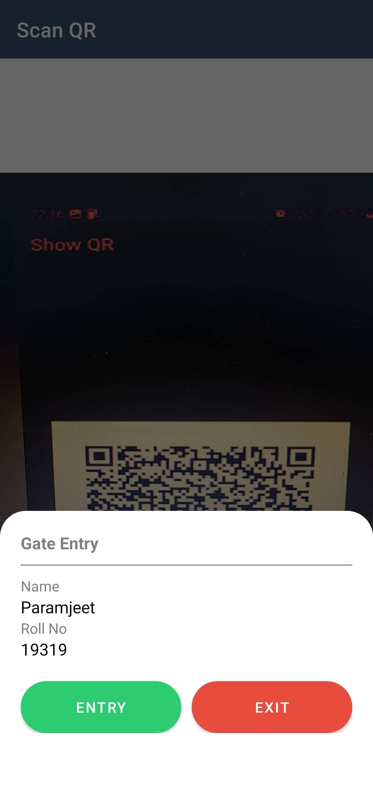
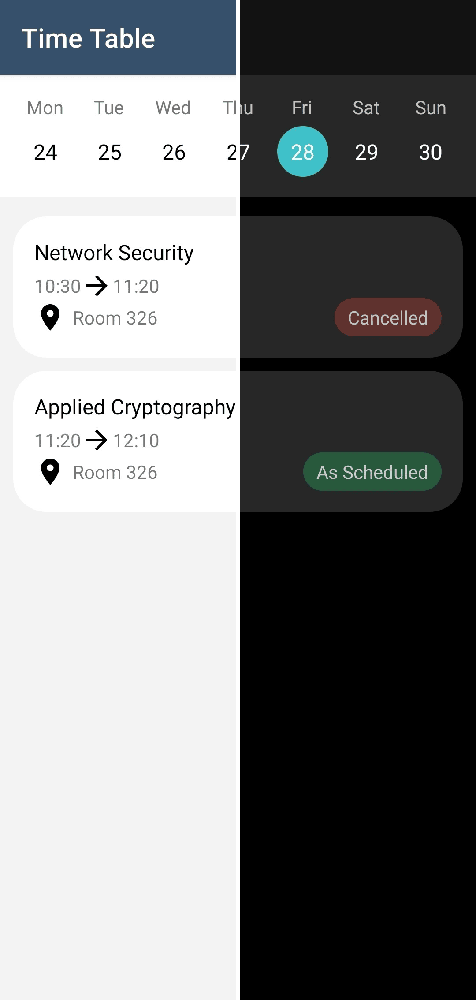
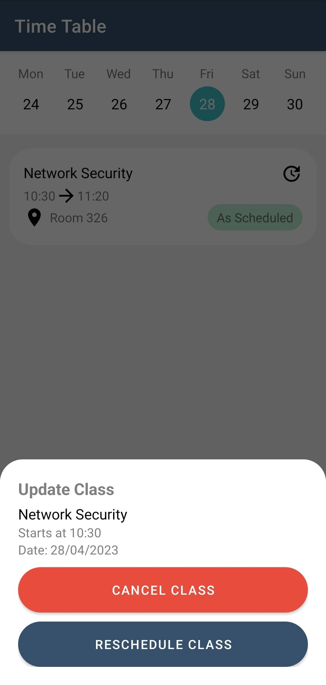
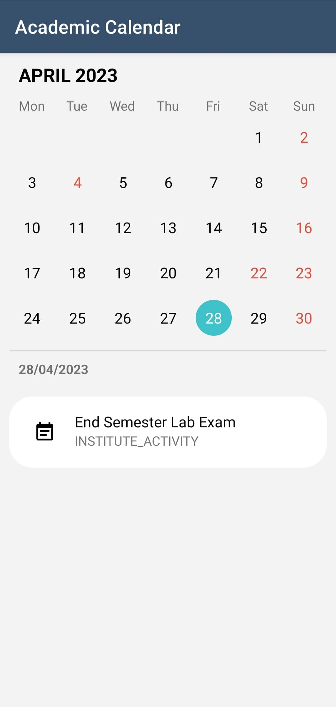
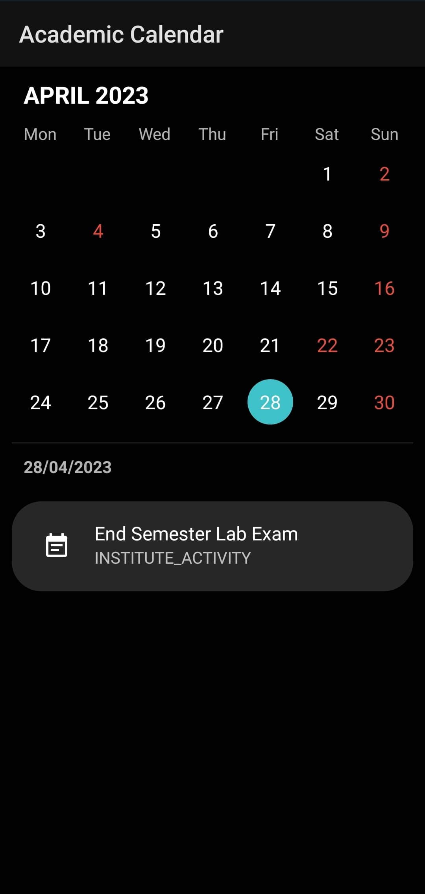
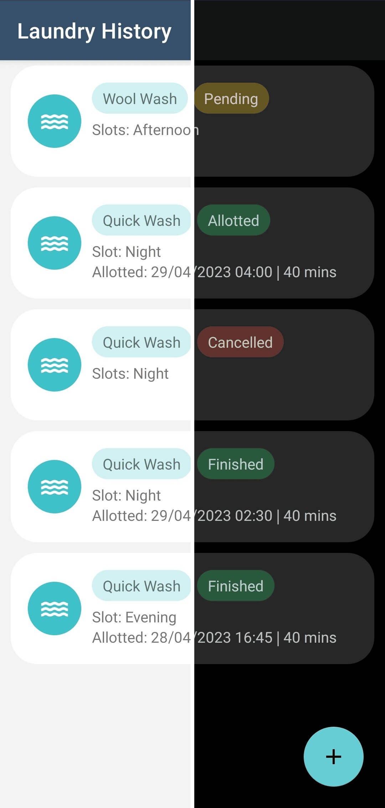

    
    <h1 align="center">IIIT Una App</h1>
    <h2 align="center">A One-Stop Shop for Students</h2>

&nbsp;&nbsp;&nbsp;&nbsp;&nbsp;&nbsp;&nbsp;&nbsp;

## 🌟 About

College can be a busy and overwhelming time. There are so many things to keep track of, from classes and assignments to extracurricular activities and social life. It can be hard to stay on top of everything without some help.

That's where the IIITU App comes in. This app is designed to make college life easier for students by providing them with a one-stop shop for all of their needs. With the College App, students can:
- Check their grades and track their progress
- Submit applications and get approval for requests
- Report emergencies and get help quickly
- Request gate passes and leave passes
- View their timetable and academic calendar
- Schedule laundry and get access to washing machines
- Receive personalized notifications

## 📃 Frontend
- [Android (Kotlin)](https://www.geeksforgeeks.org/a-complete-guide-to-learn-kotlin-for-android-app-development/)
- [Firebase Cloud Storage](https://firebase.google.com/products/storage) - For storing profile pictures, thumbnails, etc.
- [Firebase Cloud Messaging](https://firebase.google.com/products/cloud-messaging/) - For Push Notifications.
- [Retrofit](https://square.github.io/retrofit/) - For making API calls.
- [Lottie](https://airbnb.design/lottie/) - For displaying JSON based animations.
- [Glide](https://bumptech.github.io/glide/) - For loading images from urls.

## 📃 Backend
- [NodeJS](https://nodejs.org/en/) + [ExpressJS](https://expressjs.com/) + [MongoDB](https://www.mongodb.com/)
- [Mongoose](https://mongoosejs.com/) - For Elegant MongoDB object modeling

## ✨ Features

The College App has a variety of features that make it a valuable tool for students. Some key features include:

### 1. Grades / Results

Students can view their grades for all of their classes, as well as their overall GPA. They can also track their progress throughout the semester and see how they are doing compared to their classmates.

|                  Light Mode                  |                         Space                          |                  Dark Mode                  |
|:--------------------------------------------:|:------------------------------------------------------:|:-------------------------------------------:|
|  |  |  |
|  |                                                        |  |

### 2. Applications

Students can submit applications for things like scholarships, internships, and housing. They can also track the status of their applications and see if they have been approved or rejected.

|                       Light Mode                       |                              Space                               |                       Dark Mode                       |
|:------------------------------------------------------:|:----------------------------------------------------------------:|:-----------------------------------------------------:|
|  |  |  |
|  |                                                                  |  |
|  |                                                                  |  |
|  |                                                                  |  |
|  |                                                                  |  |

### 3. Emergency Reporting

Students can report emergencies, such as a fire or a medical emergency. When an emergency is reported, the appropriate authorities will be notified immediately.

|              Light Mode              |                     Space                      |              Dark Mode              |
|:------------------------------------:|:----------------------------------------------:|:-----------------------------------:|
|  |  |  |
|  |                                                |  |

### 4. Gate Pass

Students can request gate/leave passes to leave campus. Leave passes must be approved by a faculty member or staff member before they can be used.

|                   Light Mode                    |                           Space                           |                   Dark Mode                    |
|:-----------------------------------------------:|:---------------------------------------------------------:|:----------------------------------------------:|
|  |  |  |
|  |                                                           |  |
|  |                                                           |  |

### 5. Time Table

Students can view their timetable for the current semester. They can also view their academic calendar and see when their exams and assignments are due.

|                    Light Mode                     |                            Space                            |                    Dark Mode                     |
|:-------------------------------------------------:|:-----------------------------------------------------------:|:------------------------------------------------:|
|  |  |  |
|  |                                                             |  |
|   |                                                             |   |

### 6. Laundry Scheduling

Students can schedule laundry and get access to washing machines. When a student schedules laundry, the guard will scan their QR code before giving them access to the washing machines.

|                  Light Mode                  |                         Space                          |                  Dark Mode                  |
|:--------------------------------------------:|:------------------------------------------------------:|:-------------------------------------------:|
|  |  |  |
|  |                                                        |  |

### 7. Notifications

Students can receive personalized notifications about things like upcoming events, changes to their timetable, and new grades.

|                        Light Mode                        |                               Space                                |                        Dark Mode                        |
|:--------------------------------------------------------:|:------------------------------------------------------------------:|:-------------------------------------------------------:|
|  |  |  |

&nbsp;&nbsp;&nbsp;&nbsp;&nbsp;&nbsp;&nbsp;&nbsp;

## Connect with me

 
 

 
