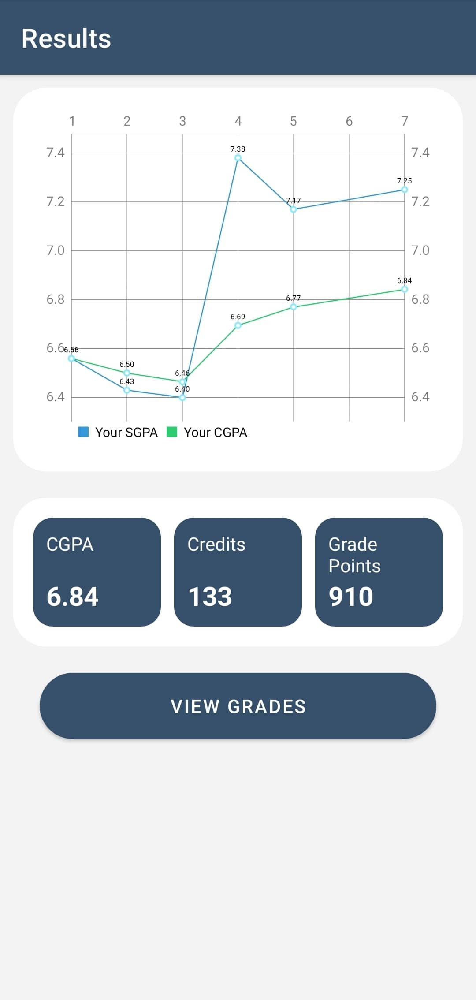
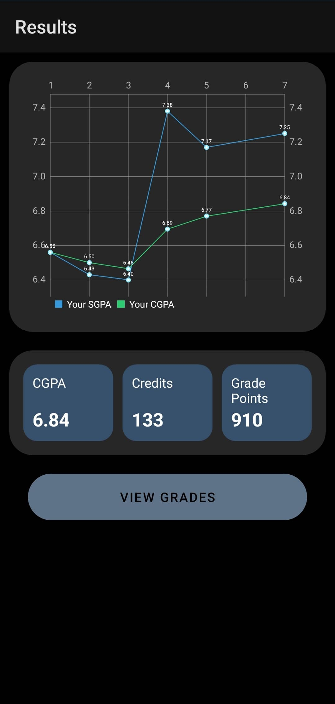
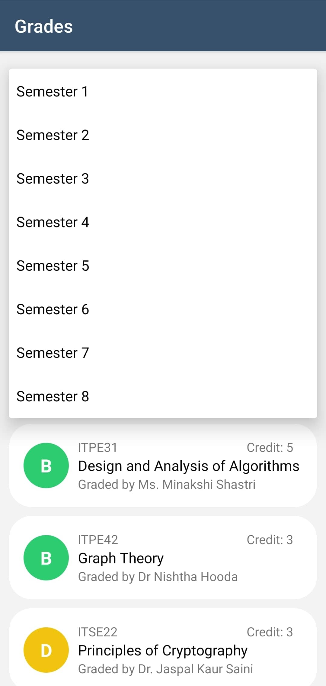

# Results Feature

The Results feature is a core component of our app that allows users to view and analyze their performance over time. With this feature, users can easily see how they've progressed over time, identify areas for improvement, and track their goals.

## How it Works

The Results feature works by fetching data from the APIs and generating visualizations that show their progress. Users can filter their results by semester.

## Screenshots

### Light Mode

|                  Light Mode                  |                  Dark Mode                  |           Empty            |
|:--------------------------------------------:|:-------------------------------------------:|:--------------------------:|
|  |  |  |
|  |  |                       |
|  |  |                       |

## Getting Started

To start using the Results feature, simply navigate to the "Results" tab in the app. From there, you can view your performance data, filter your results, and track your progress over time.

## Contributing

We welcome contributions to our app! If you have suggestions for improving the Results feature, please submit a pull request or contact us at iiitu.appteam@thesupremeone.in

## License

This app is licensed under the MIT License. See the LICENSE file for details.
