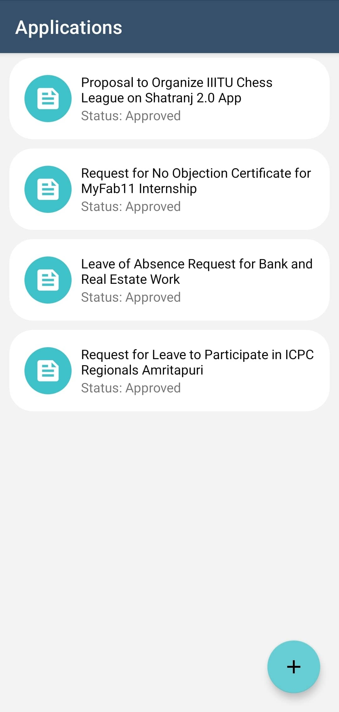
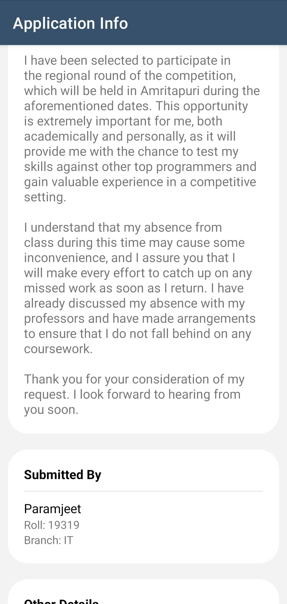
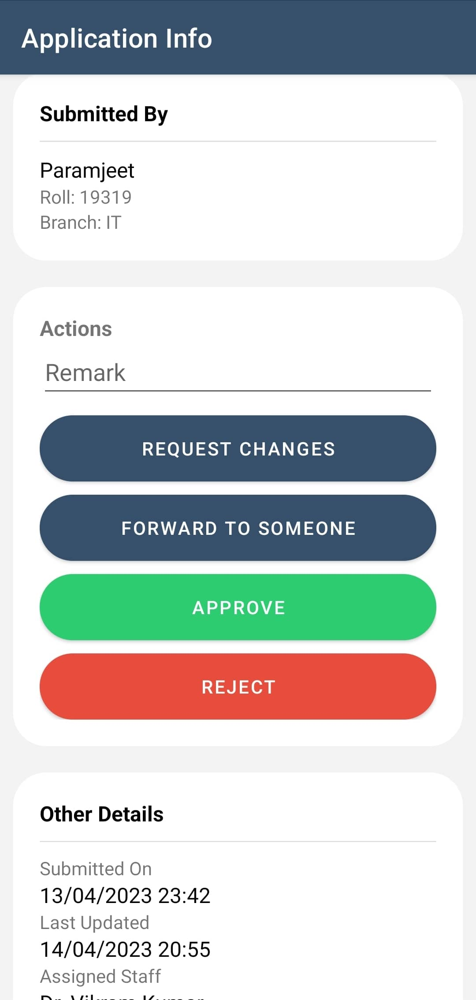
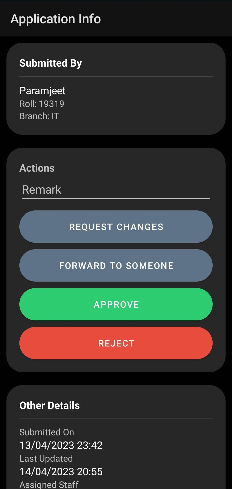
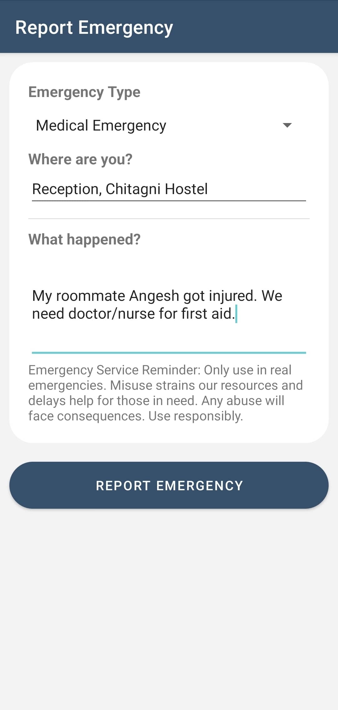
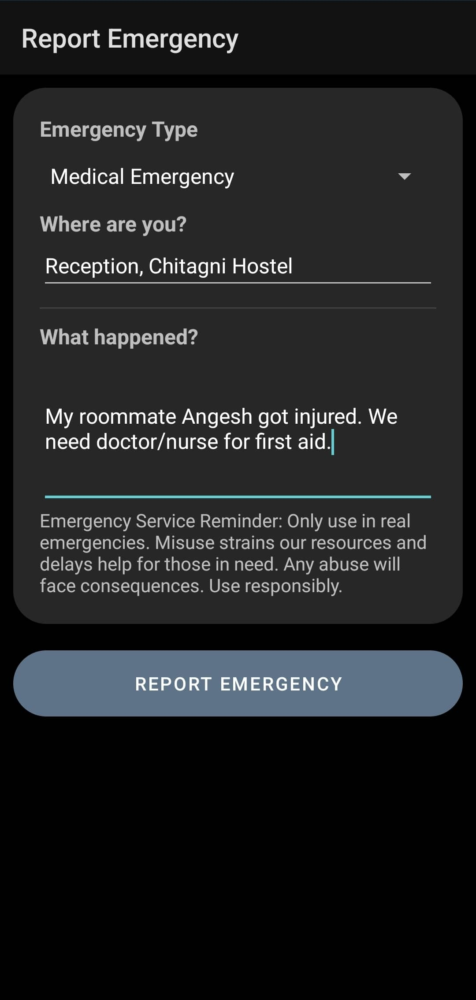
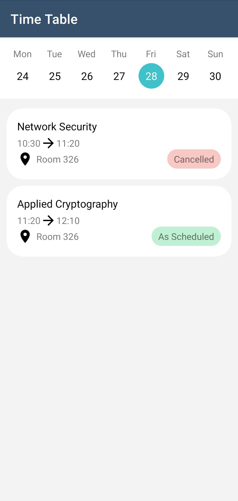
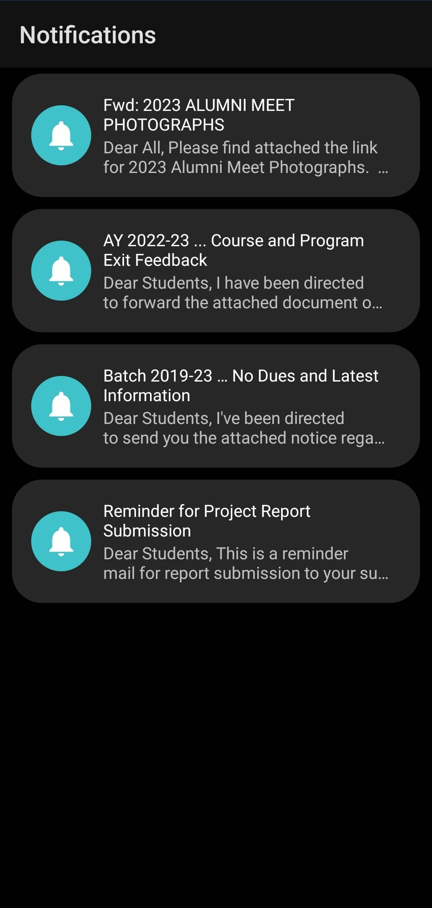

    <h1 align="center">IIIT Una App</h1>
    <h2 align="center">A Comprehensive College Management Application</h2>

College life can be overwhelming, with various activities to manage, including academics, emergency responses, and administrative procedures. To address these challenges, the IIIT Una App was developed as an all-in-one application that allows students to access different services from a single platform. This application is designed to cater to the needs of students, staff, and faculty members of Indian Institute of Information Technology, Una.

The IIIT Una App features several sections, each with unique services that cater to different aspects of college life. These sections include the Results, Applications, Emergency Response System, Gate Pass, Time Table, Academic Calendar, Laundry, and Notifications.

## Results

|                  Light Mode                  |                         Space                          |                  Dark Mode                  |
|:--------------------------------------------:|:------------------------------------------------------:|:-------------------------------------------:|
|  |  |  |
|  |                                                        |  |
|  |                                                        |  |

## Applications

|                       Light Mode                       |                            Space                            |                       Dark Mode                       |
|:------------------------------------------------------:|:-----------------------------------------------------------:|:-----------------------------------------------------:|
|  |  |  |
|  |                                                             |  |
|  |                                                             |  |
|  |                                                             |  |
|  |                                                             |  |
|  |                                                             |  |

## Emergency Response System (ERS)

|              Light Mode              |                       Space                        |              Dark Mode              |
|:------------------------------------:|:--------------------------------------------------:|:-----------------------------------:|
|  |  |  |
|  |                                                    |  |

## Gate Pass

|                   Light Mode                    |                          Space                           |                   Dark Mode                    |
|:-----------------------------------------------:|:--------------------------------------------------------:|:----------------------------------------------:|
|  |  |  |
|  |                                                          |  |
|  |                                                          |  |
|  |                                                          |  |

## Time Table

|                    Light Mode                     |                           Space                           |                    Dark Mode                     |
|:-------------------------------------------------:|:---------------------------------------------------------:|:------------------------------------------------:|
|  |  |  |
|  |                                                           |  |

## Laundry Scheduling

|                  Light Mode                  |                         Space                          |                  Dark Mode                  |
|:--------------------------------------------:|:------------------------------------------------------:|:-------------------------------------------:|
|  |  |  |
|  |                                                        |  |

## Notifications

|                        Light Mode                        |                            Space                             |                        Dark Mode                        |
|:--------------------------------------------------------:|:------------------------------------------------------------:|:-------------------------------------------------------:|
|  |  |  |

## Contributing

We welcome contributions to our app! If you have suggestions for improving the IIIT Una App, please submit a pull request or contact us at iiituappteam@thesupremeone.in

## License

This app is licensed under the MIT License. See the LICENSE file for details.
